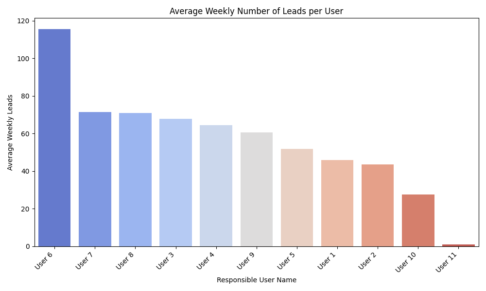

# 📊 Call Center Interaction Reporting (Anonymized Real Data)

> ⚠️ **Notice:** This project is based on a real-world CRM use case. All sensitive data such as lead names, user names, and contact information has been **anonymized** using consistent dummy values for privacy and confidentiality. Visualizations accurately reflect real behavior patterns.

---

## 📁 Project Structure

- **`main.py`**: Main script. It runs the report generation logic via `utils.py`.
- **`utils.py`**: Connects to the Kommo API, fetches data, processes it, and exports `.csv` files.
- **`analysis_talk.py`**: Creates visualizations based on conversation (talk) data. Outputs are saved in `talk_analysis_visuals/`.
- **`analysis_lead.py`**: Generates visual analytics based on lead creation data. Saved in `lead_report_visuals/`.
- **`config.py`**: Stores API access configurations like `BASE_URL` and `ACCESS_TOKEN`.

---

## ⚙️ Main Functions

- `generate_daily_talk_report(output_to_csv=True)`  
  → Fetches and processes call center talk records from the Kommo CRM API.  
  → Output: `dummy_talk_report_with_response_times.csv`

- `generate_daily_lead_report(output_to_csv=True)`  
  → Fetches and processes lead creation records from the Kommo CRM API.  
  → Output: `dummy_lead_creation_report.csv`

Each function outputs anonymized `.csv` files and optionally generates `.png` visual reports.

---

## 📦 Output Files

> 🛡️ **Note**: Original filenames (e.g., `kommo_daily_lead_creation_report.csv`) have been anonymized for public sharing.

- `dummy_talk_report_with_response_times.csv`  
- `dummy_lead_creation_report.csv`  
- `.png` visualization files located in:
  - `talk_analysis_visuals/`
  - `lead_report_visuals/`

---

## 📊 Sample Visualizations

### 🔹 Hourly Lead Creation by User  


> This heatmap visualizes which hours are most active for lead creation across all users.  
> It is calculated as an **average over the last 30 days** of activity.

### 🔹 Average Weekly Number of Leads per User   


> This bar chart displays the **average number of leads created per user per week**, helping to evaluate and compare user performance trends.
> Calculated based on the last 30 days of data to reflect recent activity patterns.

### 🔹 Hourly Lead Creation Trend (User 3)


> This line chart shows the **hour-by-hour lead creation activity of a specific user (User 3)** throughout the day.
> It helps identify patterns in user work performance and peak productivity hours based on recent data.

---

### 🔹 Hourly Talk Density


> This bar chart displays the **distribution of total call center interactions by hour of the day**.

### 🔹 Talk Channel Distribution


> This pie chart illustrates the **distribution of communication channels** used in customer interactions (e.g., WhatsApp, Instagram Business, Facebook).
> Helps identify which platforms are most actively used by the customer support team — enabling better resource allocation and platform strategy.
 
### 🔹 Hourly Talk Density by Channel


> This heatmap illustrates **which communication channels (e.g., WhatsApp, Instagram, Facebook)** are more active at specific hours of the day.
> It helps identify time-based channel usage trends, enabling efficient staffing and scheduling of support teams across platforms.

## 💻 Requirements

- Python 3.x  
- Required libraries:
  - `requests`
  - `pandas`
  - `matplotlib`
  - `seaborn`

Install dependencies:

```bash
pip install -r requirements.txt
